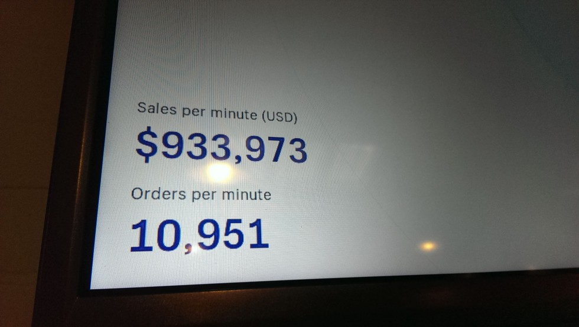

Sometimes we really do over-engineer things.

<!-- end -->

_This article was originally written by me for Eastside Co's blog: you can find the original here_

**“Right, what are we going to use...Sentry? Pagerduty? Have we got an account? What do you mean, we’ve not set up auto-scaling groups? OK, have we got time to create them instead of manually spinning up AMI EC2s?”**

Black Friday has had a very patchy impact in the UK on the high street over the last decade, but where it is undoubtedly having the most influence is in the world of ecommerce - where the territory market restrictions are removed. According to UK-based hosting provider UKFast, an estimated £1.4 billion was spent during Black Friday - but this is dwarfed by the $5 billion spent in the US.

## AWS Performance Statistics

Our clients for whom we have created marketing, development and design solutions will be trading with the US, but the biggest hit for us at Eastside Co comes from our 9 apps, available in the Shopify app store. Of these, 16,194 installs are currently active - that’s a lot of US installs. One app alone, Hindsight, generates 13GB of data every day.

Reading the statistics from AWS Cloudwatch makes for some interesting reading about the strain that was being put on our apps. These apps are written in Laravel PHP and vue.js, and are for the most part managed in terms of deployment pipelines by Forge. So, what can an app with this fairly straightforward infrastructure handle?

Our peak HTTP requests on Black Friday (23rd November 2018) were hovering at around 2 million an hour from 2pm to 8pm GMT. From 22nd to 23rd November the CDN served the Shopify Embedded App SDK 1.88 million times, the total data serve totalling 126.75GB on that one file.

Shopify themselves created a dashboard for the event, updated in real time every second. While we set up several screens to monitor Cloudwatch with some custom dashboards, we also kept an eye on the traffic. The moment captured in the image below, about 2pm on Black Friday, captures the scale of orders being processed - $933,973 of transactions per minute, 10,951 orders per minute. Considering that our various microservices and apps are hooked into so many Shopify merchant stores, you can imagine what the load balancers looked like.

## How did we prepare for Black Friday?

So - to get to the point of of all this: what did we do to prepare? How did Black Friday play out?

The TL:DR of this is: we didn’t need to do much. We set up a couple of monitors with custom dashboards on Cloudwatch with 40 or so alarms set up on ElastiCache, EC2 and our Aurora RDSs, and only scaled up one app manually - CartConvert.

CartConvert is installed on 2,200 merchant stores at the time of writing; it runs a recommendation engine that generates API calls to Shopify wherever the code is called on your store - that’s a lot of calls - the solution? Scaling the API layer 3x and plugging them into the load balancer - that’s it. With 4x EC2s in an API layer handled by the load balancer and about 1,000 queries a second hitting Aurora, we spent Black Friday watching screens and fixing - well, nothing, as it turns out.

## Monitoring Black Friday

So, we didn’t exactly go mad with the architecture. What about the monitoring? Again, we found it best to play it simple. I’ve seen Datadog, New Relic, PagerDuty, Sentry and Slack all hooked up to the point of information overload. You know the kind of stack - the one where one Slack channel is hooked up to Cloudwatch and an autolinter and a code quality scanner and Sentry. While there are many use cases for this amount of tooling, we kept it simple, just like how our AWS is configured: using Cloudwatch hooked up to our phones, changing thresholds for alarms on all our apps to compensate for the expected spike in CPU use.

It’s so easy right now to get sucked up into a whirlpool of event-driven architecture, thousands of lambdas or microservices and auto scaled groups. It sounds so obvious, but at Eastside Co we found it far more productive to keep our architecture simple and focused. The result?

A lot of happy merchants, and no burning servers. Here’s to next year!
