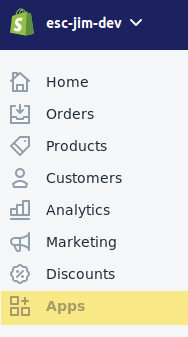
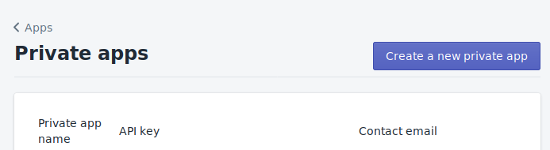
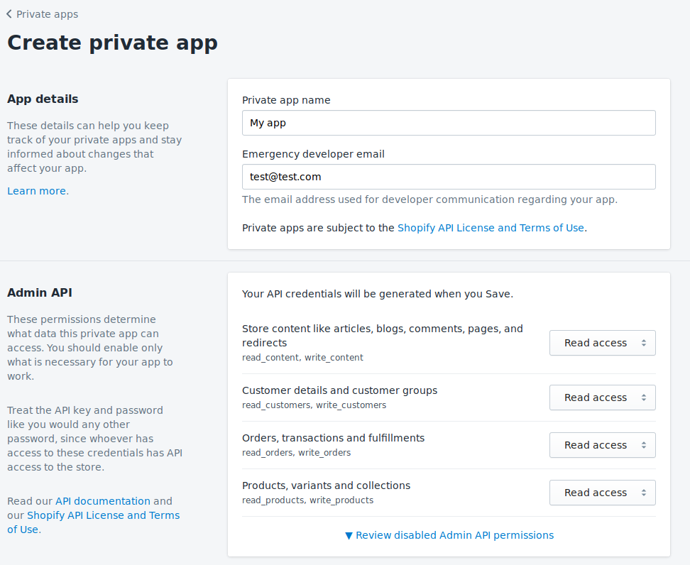
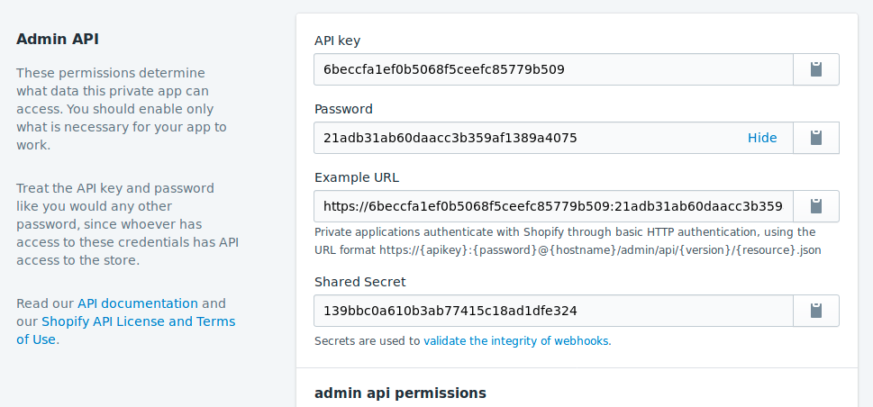

Basic building blocks for an integration with Shopify's API using Laravel.

<!-- end -->

_This article was originally written by me for Eastside Co's blog: you can find the original [here](https://eastsideco.com/blog/developing-shoth-laravel-php)_

The Shopify platform contains a whole host of built in functionality. However, thanks to its fully featured REST and GraphQL API access, it also has a thriving app store with a huge range of plug-ins designed to enhance Shopify store functionality in many ways. I'll talk you through a Shopify app development tutorial to help you get started on making your own Shopify app, using the Laravel PHP framework.

## What is a Shopify App?

A Shopify app is an externally-hosted service that has access to and can manipulate a Shopify store. For the most part, any feature you can see in the admin panel can be accessed and changed via the API - it can modify/create products, view or change orders and so on. Apps are a great way to automate common tasks such as bulk-editing collections or extending your store's functionality, like adding reviews to your products.
The 2 Types of Shopify Apps

Public apps can be submitted to the app store and used by multiple stores. To create and submit normal apps to the Shopify App Store, you need to own a Shopify Partner account.

Private apps are usually used by a single store. In this article, we’ll be going through the steps for Shopify private app development, as they can be created by anyone with a Shopify store and require less steps to set up.

## How to Create a Shopify App Using PHP

To follow this guide, you will need:

* A Shopify store you want to make an app for.
* PHP7.2 or higher and some familiarity with the language (https://www.php.net/supported-versions.php).
* Some familiarity with a command line (cmd.exe/Powershell for Windows, bash/zsh/fish for MacOS and unix-like distributions).
* Some familiarity with Composer.

## API Keys

Let’s begin by creating a set of API keys for our app. Head to the Apps panel from the right hand navigation.





Click ‘Create a new private app’ to get the prompt to name your app.



We'll leave the API dropdowns so that the app only has read access to your store.



Make a note of your new credentials. And with that step, it’s time to set up a local Laravel & vue.js app.

## Setting up a Laravel Skeleton

So, first we’re going to install a fresh Laravel skeleton app. You can do this via the Laravel installer (https://github.com/laravel/installer), but the quickest route is to use Composer’s create project. Open up your command line and create a new project:

`composer create-project --prefer-dist laravel/laravel shopifyApp`

We’re going to use Twig (https://twig.symfony.com/) instead of Laravel’s built-in Blade templating system for the front end, because the syntax Twig uses is based on Ruby’s Liquid templating system, used by Shopify on its platform. We’re going to be using Rob Crowe’s bridge connector for Laravel. Install Twig, following the instructions on the readme located here - https://github.com/rcrowe/TwigBridge

Now we have Twig, let’s get a page up and running by creating a new route, controller and Twig template. To create a new controller, in the command line run

`php artisan make:controller shopifyController`

Now we need to wire up a route, controller and view. Add a new route to **routes/web.php**:

`Route::get('/index', 'ShopifyController@index');`

Create the method in your controller, which will now be in
**/app/Http/Controllers/ShopifyController**:

```
<?php

namespace App\Http\Controllers;

class ShopifyController extends Controller
{
  public function index()
 {
     return view('index');
   }
}
```

The last part is to create the ‘index’ view - create a new file in: **/resources/views called index.twig**.

## Using Eastside Co’s API Wrapper

We now need to use the Eastside Co Shopify API wrapper to bring us back some data to render. Eastside Co have already got a PHP package on packagist - it’s an API code wrapper for common REST API tasks with Shopify. Navigate into the ShopifyApp directory in your command line and install the Eastside Co API:

`composer require esc/shopify`

To enable the installed package, we need to add it to services and install assets. You do this by doing the following:

Add **\Esc\Shopify\Providers\APIServiceProvider::class** into the providers array in **/config/app.php**.

Run **php artisan vendor:publish** in the command line to copy the package assets into Laravel.

We can now input the ShopifyAPI keys. Create a copy of your **.env.dist** and called it **.env.** In the .env file, add the keys that the API object will read in when the service is created in Laravel:

```
SHOPIFY_API_KEY = <API Key>
SHOPIFY_API_SECRET = <Shared Secret>
SHOPIFY_ACCESS_TOKEN = <Password>
SHOPIFY_SHOP_DOMAIN=<my-store-domain.myshopify.com>
```

## Final Render

Let’s get the data in the controller and pass it to the index Twig template we created. Change the controller’s index method to look like the following:

```
public function index() {
    $shopifyApi = app(‘ShopifyAPI’);
    $products = $shopifyApi->call('GET', 'admin/products.json&page=1');
    return view('index', (array) $products);
}
```

We’re now passing the first page of our store’s products to Twig, which we can now render out - open the resource/views/index.twig file we created. You can use a foreach loop in twig which operates the same as the php foreach function:

```
<html>
   <p>This is an example Shopify APP page!</p>
   
       This product is called: {{ product.title }}</br>
   
</html>
```

That’s it! Navigate to your route and the product titles will be rendered out by Twig.

A repository of this basic scaffolding is available on our Github, at https://github.com/EastsideCo/blog-basic-laravel

Hopefully that helps give you some insight into the process behind creating a private Shopify app. If you have an idea for a private app but need developer support, get in touch - we have a whole team of developers dedicated to creating public and private Shopify apps for a whole range of functionality.
