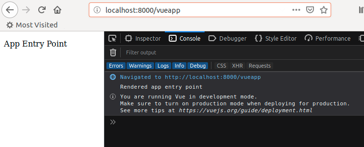
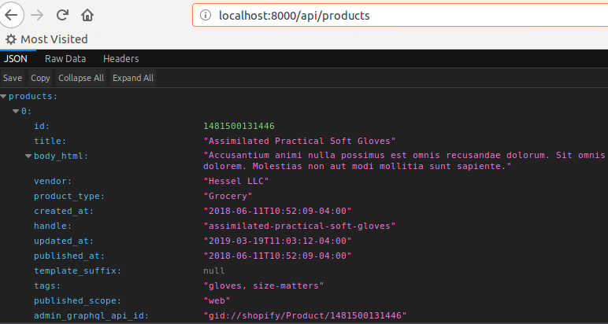
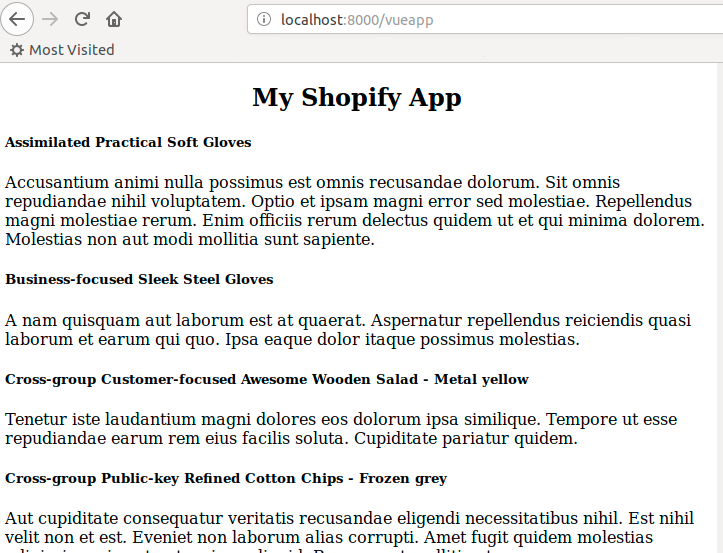
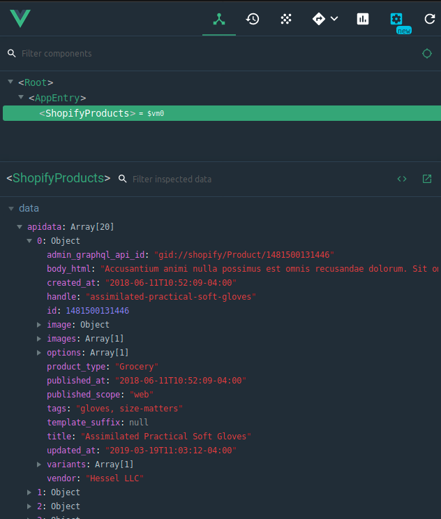

Continuing to build integrations with Shopify, using Polaris & Vue.js

<!-- end -->

_This article was originally written by me for Eastside Co's blog: you can find the original here_

Note: this article is about building a Vue.js single page app on top of the Laravel app created in this article. Before reading this, make sure you’ve read the previous article about building an app with Laravel as we’ll be using that existing code.

## What is Vue.js?

Vue.js is a JavaScript front end framework, comparable to similar frameworks such as React and originally derived from AngularJS. Compared to the other frameworks, it’s designed to be somewhat lighter, so that you can use it as just a presentation layer only if you wish - but can you can also scale it massively with full state management or use a framework on top of Vue such as Nuxt.js. You can find out more info about Vue.js here.

## What is Polaris?

Polaris is Shopify’s UI design framework, comparable to other UI frameworks such as Bootstrap or SemanticUI. At Eastside Co we have a Vue.js port of the library for a consistent UI in our apps.

## Setting up Vue.js for compiling

Vue comes with Laravel out of the box, but there are some customisations that will make development easier. Laravel comes with Laravel Mix which is a neat wrapper around Webpack. Webpack compiles all of your frontend assets down to what you want to serve to the client’s browser - Laravel comes with an implementation of this with lots of defaults baked-in. Let’s optimise Webpack’s output a little. Open **webpack.mix.js** in your project’s root. Change it to:

```
mix.js('resources/js/app.js', 'public/js')
   .sass('resources/sass/app.scss', 'public/css');

mix.webpackConfig({
   resolve: {
       extensions: [
           '.js', '.vue',
       ],
       alias: {
           '@': path.resolve(__dirname, 'resources/assets/js'),
       },
   },
   devtool: “inline-source-map”
});
```

Here we’ve told webpack to alias files within the resources/assets/js folder for use in import statements, and to recognise .vue and .js extensions so that we don’t need to use full filenames in JavaScript. The devtool option also makes wepack generate source maps for our compiled JS to aid debugging in the browser faster.

We can now run npm to install our front end dependencies, and run a server to watch for changes to our JavaScript files. Head to the terminal and type:

`npm install`

`npm run dev`

Now, we need to hook our base Laravel route into our Vue app.

## Setting up Vue.js in Laravel

We need to to a little tweaking in order to get a decent scaffold from Laravel to Vue. The first things we need to do are to import Vue into a base Twig template, then create an entry point for our app.

So that we don’t confuse things, let’s create a new route, controller method and twig template.

**routes/web.php**

```
Route::get('/vueapp', 'ShopifyController@vueapp');
```

**app/Http/Controllers/ShopifyController.php**

```
public function vueapp()
{
   return view('vueapp');
}
```

As Vue is going to use an endpoint we create in Laravel, we’ve ditched the ShopifyAPI - but this will be used later. Now we need to connect Vue into our new Twig template, which we’ve named vueapp. Create the following file:

**resources/views/vueapp.twig**

```
<!DOCTYPE html>
<html>
   <head>
       <title>My VueJs app</title>
       <meta name="csrf-token" content="{{ csrf_token() }}">
   </head>
   <body>
       <div id="app">
           <app-entry></app-entry>
       </div>
       <script src="{{ asset('js/app.js') }}"></script>
   </body>
</html>
```

The CSRF token is important - Laravel passes a token to Vue to prevent cross-site request forgeries. There are a couple of other things happening here - firstly, `<div id="app">` is the div tag we are binding Vue to, and `<app-entry>` is a custom Vue component that we’ve not built yet, so we’ll build that out shortly.

## Building Vue Scaffolding

Next, we need to build our app entry point for our app. We’re treating it like a component, but sitting it outside the baked-in components folder as it’s the front end entry point for the rest of Vue. Create a new file:

**resources/js/AppEntry.vue**

```
<template>
   <p>App Entry Point</p>
</template>

<script>
   export default {
       mounted() {
           console.log('Rendered app entry point')
       }
   }
</script>
```

So, the last part is to register the `<app-entry>` component in the Vue bootloader. Head to
**resources/js/app.js**

There’s a lot of comments in here from the Laravel boilerplate code - delete all of the code and replace it with the following:

```
require('./bootstrap');

window.Vue = require('vue');

Vue.component('app-entry', require('./AppEntry.vue').default);

const app = new Vue({
   el: '#app',
});
```

So, our entry component has been loaded, and Vue has been booted, being bound to the div id app. Load up the route in your browser:

http://localhost:8000/vueapp

And we can see with our browser devtools open that vue is initialized. We’re up and running!



## Creating an API endpoint

Now we have an entry point we’ll create a new component that will render out a list of products. Before we can create the frontend component, we’ll need to create an API endpoint which will effectively be a proxy from Shopify’s API.

Laravel comes with an automatically configured /api/ base root for API calls, with separated logic from HTTP routes. Add the following line:

**routes/api.php**

`Route::get('/products', 'ShopifyController@products');`

We’ve not created the ‘products’ method in the ShopifyController, so let’s create it:

**app/Http/Controllers/ShopifyController.php**

```
public function products() {
   $shopifyApi = app('ShopifyAPI');
   $products = $shopifyApi->call('GET', '/admin/products.json');

   return (array) $products;
}
```

Navigate to your endpoint and you should get the data back:



That’s it for the API endpoint - we’re not using any authorisation as this is a basic guide, but you can check out https://laravel.com/docs/5.7/authentication for more info on custom auth implementations including basic, bearer tokens and oAuth.

## Creating a Component and Fetching API Data

Let’s create the component that we’re going to render the products in - create a new file in the components directory:

**resources/js/components/ProductComponent.vue**

```
<template>
  <div id=”root element”>Vue components always need one root element</div>
</template>

<script>
   export default {
       mounted() {
           console.log('Component loaded')
       },
       data() {
           return {
               apidata: ""
           }
       },
   }
</script>
```

Now register the component in Vue:

**resources/js/app.js**

```
Vue.component('shopify-products', require('./components/ProductsComponent.vue').default);

And drop the component into our app template:

<template>
   <div>
       <shopify-products></shopify-products>
   </div>
</template>
```

There are a few things to explain with the Vue template before we can fetch products from the api endpoint and loop over them. Firstly, the logic behind the `<script>` tag - each Vue component has a lifecycle which can be tapped into at various stages and enables you to emit events, set watchers; anything you’ll need can be coded here.

You can find out more about coding components here. We’ve started off by just adding the **data()** method, which returns data that you’ll use or bind to the component. We’ve named a key in here apidata and created it as a blank string - the reason for this is that it will be where the products are stored for the components - once we code in a fetch after the module has loaded in the lifecycle.

To fill this data, we’re going to add a method, using axios which will be called when the created() method is executed in the lifecycle.

**resources/js/components/ProductComponent.vue**

```
<script>
   export default {
       mounted() {
           console.log('Component loaded')
       },
       created() {
           this.fetchProducts()
       },
       data() {
           return {
               apidata: ""
           }
       },
       methods: {
           fetchProducts() {
               axios.get('/api/products').then(response => {
                   this.apidata = response.data.products
               })
           }
       }
   }
</script>
```

## Rendering in Polaris

Products will now be available to the template under **apidata** - using Vue’s **v-for** loop, we can iterate over the array in the template.

```
<template>
   <div>
       <div class="card" v-for="product in apidata">
           <h5>{{ product.title }}</h5>
           <p>{{ product.body_html }}</p>
       </div>
   </div>
</template>
```

Load up the page and bingo! Here are our products rendered out:



When developing in Vue, the Vue devtools extension is extremely useful for debugging. You can see these tools here.

If we use the devtools, we can see the value our apidata data object has taken (i.e. the API’s response which has been cast to an array):



## Hooking in Polaris

So our final part is to use EastsideCo’s Vue Polaris port to render out our products. We install the Polaris library via npm:

`npm install @eastsideco/polaris-vue`

Then we bind it into our Vue app:

**resources/js/app.js**

```
require('./bootstrap');

import PolarisVue from '@eastsideco/polaris-vue/lib/polaris-vue';
import PolarisVueCss from '@eastsideco/polaris-vue/lib/polaris-vue.css';

window.Vue = require('vue');

Vue.component('app-entry', require('./AppEntry.vue').default);
Vue.component('shopify-products', require('./components/ProductsComponent.vue').default);
Vue.use(PolarisVue);

const app = new Vue({
   el: '#app',
});
```

We will now have access to Polaris-named custom HTML tags - you can see a full list of the ported tags on the docs page at http://demo.polaris-vue.eastsideco.io/

Our template is now refactored to look like this:

**resources/js/components/ProductsComponent.vue**

```
<template>
   <div>
       <polaris-page>
           <polaris-card
               sectioned
               title="My Shopify Vue App">
               Uses EastsideCo port of Polaris to Vue
           </polaris-card>
           <polaris-card sectioned>
               <polaris-layout-section>
                   <polaris-resource-list :items="apidata">
                       <template slot="item" slot-scope="props">
                           <polaris-resource-list-item
                               :attribute-one="props.item.title"
                               :attribute-two="props.item.created_at"
                               :media="props.item.image">
                           </polaris-resource-list-item>
                       </template>
                   </polaris-resource-list>
               </polaris-layout-section>
           </polaris-card>
       </polaris-page>
   </div>
</template>
```

There’s quite a lot going on here, so let’s break it down -

The opening `<div>` is just a container - this is because Vue.js components always need a root element. We then define a CSS container for the page using `<polaris-page>`.

The layout system is defined quite well in the docs mentioned earlier.

The `<polaris-resource-list>` however is a more complex component - it takes a prop passed in, which in this case we’re passing in the response to the API endpoint we created. The resource list then has a scoped slot, in which we are creating a `<polaris-resource-list-item>`. Within the slot, you define another slot - “item” (think of this as an iteration over a foreach loop as a simple explanation) and then the whole scope of the slot (which is apidata) is named as the slot’s props. So, to get access at this point to the current iterations’ properties, we use props.item. These attributes such as attribute-one and media are parsed by the component and rendered in the Polaris library. The result is a basic product list:


And there we are - a list of products plugged into Vue Polaris.

You can find a working copy of this demo code on our repo at https://github.com/EastsideCo/polaris-vue.
